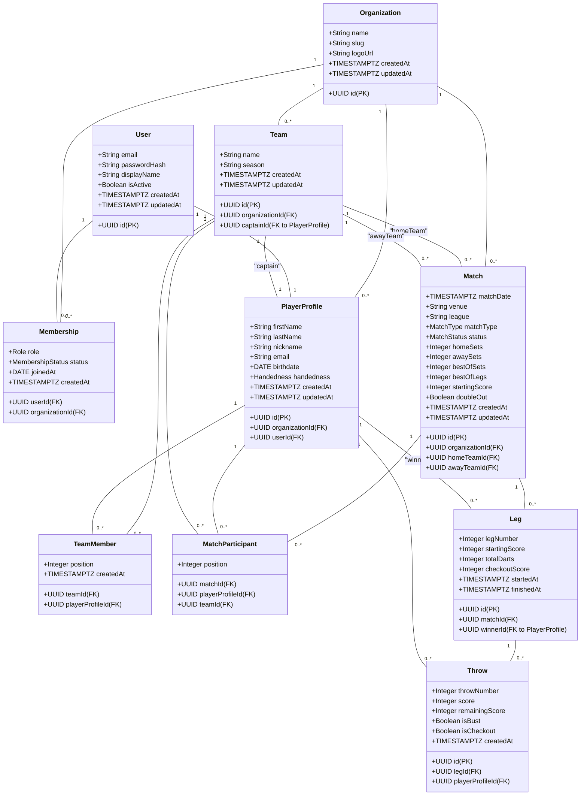

# DartClubManager - Database Schema Proposal

This document outlines the proposed database schema for the DartClubManager application. The schema is designed to be scalable, robust, and support the multi-tenancy architecture.

## Schema Diagram

Here is a Mermaid diagram visualizing the relationships between the tables:

## Table Definitions

### Core Tables

#### `organizations`
Stores information about each dart club (tenant).

| Column | Data Type | Constraints | Description |
|---|---|---|---|
| `id` | `UUID` | `PRIMARY KEY` | Unique identifier for the organization. |
| `name` | `VARCHAR(255)` | `NOT NULL`, `UNIQUE` | Name of the dart club. |
| `slug` | `VARCHAR(255)` | `NOT NULL`, `UNIQUE` | URL-friendly slug for the club. |
| `logo_url` | `VARCHAR(255)` | | URL to the club's logo. |
| `created_at` | `TIMESTAMPTZ` | `NOT NULL` | Timestamp of creation. |
| `updated_at` | `TIMESTAMPTZ` | `NOT NULL` | Timestamp of last update. |

---

### User and Membership Tables

#### `users`
Stores authentication information for all users across all organizations.

| Column | Data Type | Constraints | Description |
|---|---|---|---|
| `id` | `UUID` | `PRIMARY KEY` | Unique identifier for the user. |
| `email` | `VARCHAR(255)` | `NOT NULL`, `UNIQUE` | User's email address for login. |
| `password_hash` | `VARCHAR(255)`| `NOT NULL` | Hashed password. |
| `display_name` | `VARCHAR(255)`| `NOT NULL` | User's display name. |
| `is_active` | `BOOLEAN` | `NOT NULL`, `DEFAULT true` | Whether the user account is active. |
| `created_at` | `TIMESTAMPTZ` | `NOT NULL` | Timestamp of creation. |
| `updated_at` | `TIMESTAMPTZ` | `NOT NULL` | Timestamp of last update. |

#### `memberships`
A join table linking users to organizations and defining their roles.

| Column | Data Type | Constraints | Description |
|---|---|---|---|
| `user_id` | `UUID` | `PRIMARY KEY`, `FOREIGN KEY (users.id)` | Foreign key to the `users` table. |
| `organization_id`| `UUID` | `PRIMARY KEY`, `FOREIGN KEY (organizations.id)` | Foreign key to the `organizations` table. |
| `role` | `VARCHAR(50)` | `NOT NULL` | Role of the user in the organization (e.g., `ADMIN`, `PLAYER`). |
| `status` | `VARCHAR(50)` | `NOT NULL` | Membership status (e.g., `ACTIVE`, `INACTIVE`). |
| `joined_at` | `DATE` | | Date the user joined the organization. |
| `created_at` | `TIMESTAMPTZ` | `NOT NULL` | Timestamp of creation. |

---

### Player and Team Tables

#### `player_profiles`
Stores detailed information about a player within a specific organization.

| Column | Data Type | Constraints | Description |
|---|---|---|---|
| `id` | `UUID` | `PRIMARY KEY` | Unique identifier for the player profile. |
| `organization_id`| `UUID` | `NOT NULL`, `FOREIGN KEY (organizations.id)` | The organization this player belongs to. |
| `user_id` | `UUID` | `UNIQUE`, `FOREIGN KEY (users.id)` | Link to the user account (optional). |
| `first_name` | `VARCHAR(255)`| `NOT NULL` | Player's first name. |
| `last_name` | `VARCHAR(255)` | `NOT NULL` | Player's last name. |
| `nickname` | `VARCHAR(255)` | | Player's nickname. |
| `email` | `VARCHAR(255)` | | Player's contact email. |
| `birthdate` | `DATE` | | Player's date of birth. |
| `handedness` | `VARCHAR(50)`| | `LEFT` or `RIGHT`. |
| `created_at` | `TIMESTAMPTZ` | `NOT NULL` | Timestamp of creation. |
| `updated_at` | `TIMESTAMPTZ` | `NOT NULL` | Timestamp of last update. |

#### `teams`
Stores information about teams within an organization.

| Column | Data Type | Constraints | Description |
|---|---|---|---|
| `id` | `UUID` | `PRIMARY KEY` | Unique identifier for the team. |
| `organization_id`| `UUID` | `NOT NULL`, `FOREIGN KEY (organizations.id)` | The organization this team belongs to. |
| `name` | `VARCHAR(255)`| `NOT NULL` | Name of the team. |
| `season` | `VARCHAR(50)` | | The season the team is playing in. |
| `captain_id` | `UUID` | `FOREIGN KEY (player_profiles.id)` | The captain of the team. |
| `created_at` | `TIMESTAMPTZ` | `NOT NULL` | Timestamp of creation. |
| `updated_at` | `TIMESTAMPTZ` | `NOT NULL` | Timestamp of last update. |

#### `team_members`
A join table linking players to teams.

| Column | Data Type | Constraints | Description |
|---|---|---|---|
| `team_id` | `UUID` | `PRIMARY KEY`, `FOREIGN KEY (teams.id)` | Foreign key to the `teams` table. |
| `player_profile_id`| `UUID` | `PRIMARY KEY`, `FOREIGN KEY (player_profiles.id)` | Foreign key to the `player_profiles` table. |
| `position` | `INT` | | The player's position or order in the team. |
| `created_at` | `TIMESTAMPTZ` | `NOT NULL` | Timestamp of creation. |

---

### Match and Scoring Tables

#### `matches`
Stores information about a match between two teams.

| Column | Data Type | Constraints | Description |
|---|---|---|---|
| `id` | `UUID` | `PRIMARY KEY` | Unique identifier for the match. |
| `organization_id`| `UUID` | `NOT NULL`, `FOREIGN KEY (organizations.id)` | The organization this match belongs to. |
| `home_team_id` | `UUID` | `NOT NULL`, `FOREIGN KEY (teams.id)` | The home team. |
| `away_team_id` | `UUID` | `NOT NULL`, `FOREIGN KEY (teams.id)` | The away team. |
| `match_date` | `TIMESTAMPTZ` | `NOT NULL` | Date and time of the match. |
| `venue` | `VARCHAR(255)` | | Location of the match. |
| `league` | `VARCHAR(255)` | | The league or competition. |
| `match_type` | `VARCHAR(50)` | `NOT NULL` | `LEAGUE`, `FRIENDLY`, `CUP`. |
| `status` | `VARCHAR(50)` | `NOT NULL` | `SCHEDULED`, `LIVE`, `FINISHED`. |
| `home_sets` | `INT` | | Number of sets won by the home team. |
| `away_sets` | `INT` | | Number of sets won by the away team. |
| `best_of_sets` | `INT` | | The format of the match (e.g., best of 5 sets). |
| `best_of_legs` | `INT` | | The format of each set (e.g., best of 3 legs). |
| `starting_score` | `INT` | `NOT NULL` | `501`, `301`, etc. |
| `double_out` | `BOOLEAN` | `NOT NULL` | Whether a double is required to finish a leg. |
| `created_at` | `TIMESTAMPTZ` | `NOT NULL` | Timestamp of creation. |
| `updated_at` | `TIMESTAMPTZ` | `NOT NULL` | Timestamp of last update. |

#### `match_participants`
A join table linking players to a match, allowing for singles, doubles, etc.

| Column | Data Type | Constraints | Description |
|---|---|---|---|
| `match_id` | `UUID` | `PRIMARY KEY`, `FOREIGN KEY (matches.id)` | Foreign key to the `matches` table. |
| `player_profile_id`| `UUID` | `PRIMARY KEY`, `FOREIGN KEY (player_profiles.id)` | Foreign key to the `player_profiles` table. |
| `team_id` | `UUID` | `NOT NULL`, `FOREIGN KEY (teams.id)` | The team the player is playing for in this match. |
| `position` | `INT` | | The player's position in the match lineup. |

#### `legs`
Stores information about a single leg within a match.

| Column | Data Type | Constraints | Description |
|---|---|---|---|
| `id` | `UUID` | `PRIMARY KEY` | Unique identifier for the leg. |
| `match_id` | `UUID` | `NOT NULL`, `FOREIGN KEY (matches.id)` | The match this leg belongs to. |
| `leg_number` | `INT` | `NOT NULL` | The number of the leg within the match/set. |
| `winner_id` | `UUID` | `FOREIGN KEY (player_profiles.id)` | The player who won the leg. |
| `starting_score` | `INT` | `NOT NULL` | The starting score for this leg. |
| `total_darts` | `INT` | | Total number of darts thrown by the winner. |
| `checkout_score` | `INT` | | The score of the winning checkout. |
| `started_at` | `TIMESTAMPTZ` | | Timestamp when the leg started. |
| `finished_at`| `TIMESTAMPTZ` | | Timestamp when the leg finished. |

#### `throws`
Stores the result of each throw (3 darts) by a player in a leg.

| Column | Data Type | Constraints | Description |
|---|---|---|---|
| `id` | `UUID` | `PRIMARY KEY` | Unique identifier for the throw. |
| `leg_id` | `UUID` | `NOT NULL`, `FOREIGN KEY (legs.id)` | The leg this throw belongs to. |
| `player_profile_id`| `UUID` | `NOT NULL`, `FOREIGN KEY (player_profiles.id)` | The player who made the throw. |
| `throw_number` | `INT` | `NOT NULL` | The number of the throw in the leg. |
| `score` | `INT` | `NOT NULL` | The total score of the 3 darts. |
| `remaining_score`| `INT` | `NOT NULL` | The player's score remaining after the throw. |
| `is_bust` | `BOOLEAN` | `NOT NULL`, `DEFAULT false` | Whether the throw was a bust. |
| `is_checkout` | `BOOLEAN` | `NOT NULL`, `DEFAULT false` | Whether this throw won the leg. |
| `created_at` | `TIMESTAMPTZ` | `NOT NULL` | Timestamp of creation. |